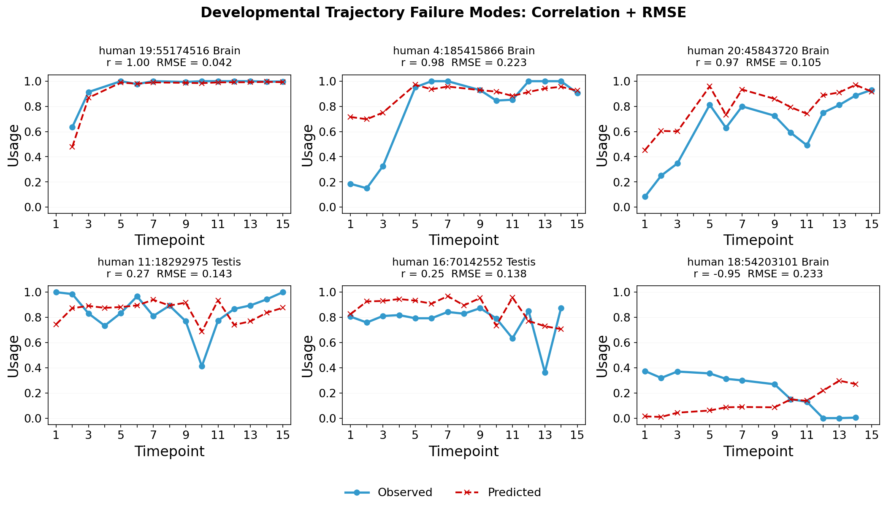
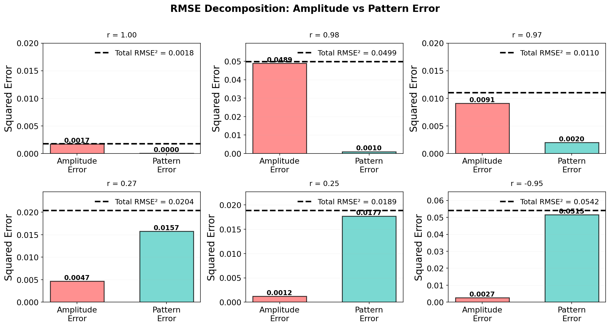

# Fine-tuning AlphaGenome for Splicing on Multi-Species Developmental Timecourse Dataset

## Dataset Overview

Cardoso-Moreira et al. (2019) generated a multi-species developmental timecourse dataset of RNA-seq data from 6 species (human, mouse, rat, rabbit, opossum, and chicken) across multiple organs (Brain (cortex), Cerbellum, Heart, Kidney, Liver, Ovary, Testis) and developmental timepoints. The deeply-sequenced dataset provides gene expression and splicing information, which can be used to fine-tune AlphaGenome.

Before running anything, make sure to activate the conda environment with all dependencies installed:
```bash
conda activate alphagenome_pytorch_genomicsxai
```

Set `species` parameter to one of the following species names, and run the commands below to prepare data for that species. The `gtf_dir` and `fa_dir` paths are set based on the species.

```bash
species=Homo_sapiens
species=Mus_musculus
species=Rattus_norvegicus
species=Oryctolagus_cuniculus
species=Monodelphis_domestica
species=Macaca_mulatta
species=Gallus_gallus

# Use new genome for human and macaque
if [[ "$species" == "Homo_sapiens" ]] || [[ "$species" == "Macaca_mulatta" ]]; then
    gtf_dir=${HOME}/sds/sd17d003/Anamaria/genomes/ensembl115/gtf/
    fa_dir=${HOME}/sds/sd17d003/Anamaria/genomes/ensembl115/fasta/
else
    gtf_dir=${HOME}/sds/sd17d003/Anamaria/genomes/mazin/gtf_ensembl/
    fa_dir=${HOME}/sds/sd17d003/Anamaria/genomes/mazin/fasta/
fi

out_dir=${HOME}/sds/sd17d003/Anamaria/alphagenome_genomicsxai/
data_dir=${out_dir}/data
mkdir -p ${data_dir}/${species}
```

## Convert gtf to parquet

```bash
python scripts/convert_gtf_to_parquet.py \
    --input ${gtf_dir}/${species}.gtf.gz \
    --output ${data_dir}/${species}/gene_annotation.parquet > logs/gtf_to_parquet_${species}.log
```

Only keep protein-coding genes:

```bash
python scripts/convert_gtf_to_parquet.py \
    --input ${gtf_dir}/${species}.gtf.gz \
    --biotype-filter protein_coding \
    --output ${data_dir}/${species}/gene_annotation_protein_coding.parquet > logs/gtf_to_parquet_${species}_protein_coding.log
```

## Prepare splice usage for training

`convert_splice_usage_to_parquet.py` converts Spliser `.combined.tsv` files to a compact `_usage.parquet` + `_usage.json` (per-site-per-condition SSE/Alpha/Beta, plus condition/class label metadata).

```bash
python -u scripts/convert_splice_usage_to_parquet.py \
    --input-dir ${HOME}/sds/sd17d003/Anamaria/spliser/data/${species} \
    --output ${data_dir}/${species}/usage.parquet \
    --min-reproducibility 0.5 \
    --min-coverage 10 \
    --strip-chr-names > logs/usage_to_parquet_${species}.log
```

## Prepare splice site annotation for training

To save parquet file with splice site annotations, run `convert_splice_sites_to_parquet.py`. It builds a splice-site annotation Parquet from a GTF (donor/acceptor positions per strand), optionally unioned or intersected with sites found in a Spliser usage file.

To save only those sites found in gtf file, you only pass the gtf file as input. Alternatively, you can also keep all sites with usage above a certain threshold, or take the union/intersection of the gtf and usage-based sites.

```bash
python -u scripts/convert_splice_sites_to_parquet.py \
    --gtf ${data_dir}/${species}/gene_annotation.parquet \
    --output ${data_dir}/${species}/splice_sites_gtf.parquet > logs/splice_sites_to_parquet_${species}_gtf.log

python -u scripts/convert_splice_sites_to_parquet.py \
    --usage-parquet ${data_dir}/${species}/usage.parquet \
    --usage-mode usage-only \
    --min-alpha 5 \
    --output ${data_dir}/${species}/splice_sites_usage.parquet > logs/splice_sites_to_parquet_${species}_usage.log

python -u scripts/convert_splice_sites_to_parquet.py \
    --gtf ${data_dir}/${species}/gene_annotation.parquet \
    --usage-parquet ${data_dir}/${species}/usage.parquet \
    --usage-mode union \
    --min-alpha 5 \
    --output ${data_dir}/${species}/splice_sites_union.parquet > logs/splice_sites_to_parquet_${species}_union.log

python -u scripts/convert_splice_sites_to_parquet.py \
    --gtf ${data_dir}/${species}/gene_annotation.parquet \
    --usage-parquet ${data_dir}/${species}/usage.parquet \
    --usage-mode intersect \
    --min-alpha 5 \
    --output ${data_dir}/${species}/splice_sites_intersect.parquet > logs/splice_sites_to_parquet_${species}_intersect.log
```

Here all usage sites are kept, in addition to the sites that are present both in the gtf and usage.

```bash
python -u scripts/convert_splice_sites_to_parquet.py \
    --gtf ${data_dir}/${species}/gene_annotation.parquet \
    --usage-parquet ${data_dir}/${species}/usage.parquet \
    --usage-mode 'intersect+usage' \
    --min-alpha 5 \
    --output ${data_dir}/${species}/splice_sites_intersect_usage.parquet > logs/splice_sites_to_parquet_${species}_intersect_usage.log
```

To additionally keep splice sites only for protein-coding genes, use pre-filtered gtf annotation file:

```bash
python -u scripts/convert_splice_sites_to_parquet.py \
    --gtf ${data_dir}/${species}/gene_annotation_protein_coding.parquet \
    --output ${data_dir}/${species}/splice_sites_gtf_protein_coding.parquet > logs/splice_sites_to_parquet_${species}_gtf_protein_coding.log

python -u scripts/convert_splice_sites_to_parquet.py \
    --gtf ${data_dir}/${species}/gene_annotation_protein_coding.parquet \
    --usage-parquet ${data_dir}/${species}/usage.parquet \
    --usage-mode 'intersect' \
    --min-alpha 5 \
    --output ${data_dir}/${species}/splice_sites_intersect_protein_coding.parquet > logs/splice_sites_to_parquet_${species}_intersect_protein_coding.log

python -u scripts/convert_splice_sites_to_parquet.py \
    --gtf ${data_dir}/${species}/gene_annotation_protein_coding.parquet \
    --usage-parquet ${data_dir}/${species}/usage.parquet \
    --usage-mode 'union' \
    --min-alpha 5 \
    --output ${data_dir}/${species}/splice_sites_union_protein_coding.parquet > logs/splice_sites_to_parquet_${species}_union_protein_coding.log

python -u scripts/convert_splice_sites_to_parquet.py \
    --gtf ${data_dir}/${species}/gene_annotation_protein_coding.parquet \
    --usage-parquet ${data_dir}/${species}/usage.parquet \
    --usage-mode 'intersect+usage' \
    --min-alpha 5 \
    --output ${data_dir}/${species}/splice_sites_intersect_usage_protein_coding.parquet > logs/splice_sites_to_parquet_${species}_intersect_usage_protein_coding.log
```

Optionally, `check_splice_positions.py` can be used to sanity-check an annotation Parquet against canonical GT/AG splice motifs in the genome FASTA — a fast way to catch off-by-one coordinate errors before training.

```bash
python scripts/check_splice_positions.py \
    --annotation ${data_dir}/${species}/splice_sites_intersect_usage_protein_coding.parquet \
    --genome ${fa_dir}/${species}.fa.gz \
    --n-sites 5000  > logs/check_splice_positions_${species}_intersect_usage_protein_coding.log
```

## Prepare orthology-based folds

For all species, download orthologs from Ensembl and run the code in `~/sds/sd17d003/Anamaria/folds_split/folds_from_orthologs.ipynb` to make orthogroup-aware splits for each species.  
For a given target input sequence length `INPUT_SEQ_LEN`, results for each `SPECIES` are saved in: `/home/elek/sds/sd17d003/Anamaria/borzoi_folds/results_orthologs_{INPUT_SEQ_LEN}/{SPECIES}/fold{FOLD}/`.


## Finetune

`finetune_splice.py` trains 5-class splice-site classification (Donor+/Acceptor+/Donor-/Acceptor-/Background) and optionally usage prediction on top of a pretrained AlphaGenome trunk. Supports linear-probe, LoRA, and full fine-tuning modes.

To finetune heads only for single species:

```bash
python -u scripts/finetune_splice.py --mode linear-probe \
    --genome ${fa_dir}/${species}.fa \
    --annotation-parquet ${data_dir}/${species}/splice_sites.parquet \
    --usage-parquet ${data_dir}/${species}/usage.parquet \
    --train-bed ${data_dir}/${species}/folds/FOLD_0/train.bed \
    --val-bed ${data_dir}/${species}/folds/FOLD_0/valid.bed \
    --pretrained-weights ${HOME}/sds/sd17d003/Anamaria/alphagenome_ft_pytorch/checkpoints/model_fold_0.safetensors
```

Finetune model for multiple species:

```bash
python -u scripts/finetune_splice.py --config scripts/configs/finetune_splice_example.yaml
```

`finetune_splice_submit.sh` / `finetune_splice_submit_*.sh` are SLURM submission wrappers around `finetune_splice.py`. The suffix encodes which species are included in that training run (`h`=human, `m`=mouse, `r`=rat, `b`=rabbit, `o`=opossum, `c`=chicken).

```bash
sbatch scripts/finetune_splice_submit_hmrro.sh
```

`finetune_splice_synthetic.py` reproduces the splice fine-tuning GPU workload (forward → loss → backward → optimizer step) with random weights and synthetic batches, for isolating training-loop performance from data loading.

```bash
python scripts/finetune_splice_synthetic.py --hours 6
```

### Classification loss

The classification head uses standard cross-entropy over the 5 classes
(Donor+/Acceptor+/Donor-/Acceptor-/Background) — unchanged from the original
AlphaGenome classification loss. `splice_classification_loss` accepts an optional
`class_weights` tensor for median-frequency class balancing
(`compute_splice_class_weights`), since Background positions typically outnumber
real splice sites ~10,000:1 — but `scripts/finetune_splice.py` never computes or
passes it (`class_weights` stays `None` throughout), so current training runs use
**plain, unweighted** cross-entropy despite that imbalance.

### Usage loss

The usage head is trained with a composite loss (`splice_usage_loss` in
[`splice_losses.py`](../src/alphagenome_pytorch/extensions/finetuning/splice_losses.py)),
combining up to three components, each isolating a different, otherwise-conflatable
kind of error. `usage_loss_weights` in the YAML config supplies each component's
weight; a component with weight `0.0` (or an omitted key) is skipped entirely — its
loss and any per-batch metrics it would log are simply not computed.

- **`bce`** — binary cross-entropy on absolute usage (SSE) in `[0, 1]`, over every
  observed `(position, condition)` pair, no eligibility filter. The baseline "get the
  absolute level right" term — this is what actually calibrates predicted usage
  fraction against the true one; the two trajectory terms below are deliberately
  blind to absolute level.
- **`delta_mse`** — per-(site, tissue) centered MSE: both predicted and true
  trajectories are first mean-centered over their own observed timepoints
  (`_tissue_centered`), then squared error is computed between the two *centered*
  curves. Centering means a constant level offset scores zero error here — this term
  is purely about trajectory *magnitude* (how big the swing is), not where it sits.
  Eligible trajectories are weighted **equally** (not by amplitude), so a handful of
  extreme-swing sites can't dominate a batch's gradient.
- **`trajectory_pearson`** — `1 - PearsonR` per (site, tissue), computed on the same
  centered curves. Pearson r is scale- and shift-invariant, so this term is purely
  about trajectory *direction/shape* — a prediction that's the right shape but at
  half (or double) the true amplitude still scores well here (that failure mode is
  `delta_mse`'s job to catch, not this term's). The correlation denominator is
  regularized by `var_floor` (fixed at `1e-3`, not YAML-configurable) so a flat
  *prediction* (near-zero variance) yields a bounded gradient (`r → 0`) instead of
  the correlation blowing up, rather than being skipped as ineligible.

`delta_mse` and `trajectory_pearson` are both restricted to the same eligibility
gate: a trajectory must have `≥ min_tp` observed timepoints *and* its median-filtered
(`median_win`-point), self-recentered excursion — max deviation from its own
filtered-baseline mean, robust to a 1-2 point noisy outlier — must exceed
`exc_floor`. Current fixed values (`_per_tissue_delta_mse` / `_per_tissue_pearson_loss`
defaults, not exposed in the YAML config): `min_tp=3`, `exc_floor=0.10`,
`median_win=5` — nicknamed "exc5" elsewhere in this codebase (`evaluate_splice.py
--trajectory-corr`, the prediction-clustering notebooks). This excludes flat sites,
noisy wobble, and single-timepoint measurement outliers, so both trajectory terms
only spend gradient on genuinely dynamic developmental sites instead of being
swamped by the (much larger) flat majority — a plain, unfiltered version of either
loss over *all* sites never learns real trajectory behavior for the dynamic
minority.

`usage_traj_warmup_epochs` (integer, default `0` = off) linearly ramps
`delta_mse`/`trajectory_pearson`'s weights from `0` up to their configured value
over the first N epochs — `bce` is always at full weight from epoch 1. The scale
factor is `min(1, max(0, (epoch - 1) / usage_traj_warmup_epochs))`, so it's `0` at
epoch 1 and reaches `1.0` (full configured weight) at epoch
`usage_traj_warmup_epochs + 1`. The point is to let the level fit (`bce`) get
established before the trajectory terms start applying gradient pressure, rather
than all three competing from epoch 1.

`tissue_cond_groups` (built automatically from each species' condition metadata, not
a YAML key) splits a site's conditions by tissue, ordered by developmental
timepoint, so `delta_mse`/`trajectory_pearson` measure *within-tissue* dynamics
rather than between-tissue level offsets. Without it, both terms would collapse to
one all-conditions group per site, dominated by between-tissue level differences
rather than genuine developmental change within a tissue.

## Evaluate

`evaluate_splice.py` generates classification (AUPRC, binary + per-class) and usage (Pearson r) predictions for one or more species from a checkpoint, writing `predictions_<species>.npz` / `usage_<species>.npz` per species.

```bash
python -u scripts/evaluate_splice.py \
    --checkpoint "${out_dir}" \
    --bed "${data_dir}/${species}/folds/FOLD_0/test.bed" "${data_dir}/${species}/folds/FOLD_0/test.bed" \
    --gtf-sites "${data_dir}/${species}/splice_sites_gtf.parquet" "${data_dir}/${species}/splice_sites_gtf.parquet" \
    --batch-size 4 \
    --device cuda \
    --output-dir "${out_dir}/predictions"
```

Alternativelly, paths to data can be read from config: `--data-config /data/data_config.json`.

`evaluate_splice_submit.sh` is a SLURM wrapper that runs `evaluate_splice.py` for every species in a model's training set in turn, writing each species' output under `<run>/<pred_dir>/<species>/`.

```bash
sbatch scripts/evaluate_splice_submit.sh
```

`predict_splice_site.py` predicts splice-site classification probabilities for a single genomic region — a
lightweight, single-region alternative to `evaluate_splice.py` for spot-checks.

```bash
python scripts/predict_splice_site.py \
    --coords 1:1000:1500 \
    --genome /path/to/genome.fa \
    --annotation /path/to/annotation.parquet \
    --checkpoint /path/to/model.pth
```

`backfill_trajectory_metrics.sh` reruns `evaluate_splice.py --skip-predictions --trajectory-corr --overwrite` 
for every directory, (re)computing `trajectory_correlation` / `trajectory_magnitude` whether or not that directory had them before.  

`list_prediction_dirs.sh` is a general lister used under-the-hood by other scripts, includiing
`backfill_trajectory_metrics.sh`. It scans every model run directory under `DIR` (default
`${HOME}/sds/sd17d003/Anamaria/alphagenome_genomicsxai`) for per-species prediction output
directories — identified by a `metrics.json` inside them, under any `*/preds_*/<species>/`
path, regardless of what the model run directory itself is named, or what follows the
`preds_` prefix (`preds_intersect_protein_coding`, `preds_gtf`, `preds_union`, `preds_usage`,
...) — and writes one tab-separated `(checkpoint, data_config, species, output_dir)` line per
match to `JOBS_FILE` (default `/tmp/prediction_dirs.txt`) — re-derived from each directory's
own `eval.log`, so no hardcoded model list. Lists every matching directory regardless of what's
already been computed inside it; its consumers decide what to do with each one.

```bash
bash scripts/backfill_trajectory_metrics.sh # PARALLEL=8 to tune
# run under the hood:
bash scripts/list_prediction_dirs.sh   # -> /tmp/prediction_dirs.txt
```

## Developmental-trajectory clustering

#### cluster_trajectories.py
Clusters *observed* developmental SSE trajectories (GP smoothing and optionally Ward hierarchical
clustering) and annotates each trajectory with a shape label. Command-line driver for the
same pipeline used by `splice_trajectory_clustering.ipynb`; building blocks live in
[`alphagenome_pytorch.clustering`](../src/alphagenome_pytorch/clustering.py).

For example, to smoothen, cluster and annotate all sites in test set of all species/tissues:

```bash
DATA_CONFIG=${HOME}/sds/sd17d003/Anamaria/alphagenome_genomicsxai/data/data_config.json
REF=${HOME}/sds/sd17d003/Anamaria/alphagenome_genomicsxai/devgp/
SPLIT=test
for SPECIES in human mouse rat rabbit opossum macaque; do
    PARQUET=${HOME}/sds/sd17d003/Anamaria/alphagenome_genomicsxai/data/combined_usage_data_${SPECIES}.parquet
        for TISSUE in Brain Cerebellum Heart Kidney Liver Ovary Testis; do
            OUT=${REF}/${SPLIT}/${SPECIES}/${TISSUE}
            mkdir -p ${OUT}
            python scripts/cluster_trajectories.py \
                --parquet-path ${PARQUET} \
                --species ${SPECIES} \
                --tissue ${TISSUE} \
                --data-config ${DATA_CONFIG} \
                --split ${SPLIT} \
                --output ${OUT} \
                --save-plots \
                > ${OUT}/cluster_trajectories_${SPLIT}.log 2>&1
            echo "Done:  ${SPECIES} ${TISSUE}"
        done
done
```

Pipeline per `(species, tissue, split)`:
1. **Prepare trajectories** — aggregate the raw usage Parquet to a per-`(site, timepoint)`
   SSE matrix, filter to sites with `≥ --min-timepoints` observed points, keep the chosen
   `--tissue`/`--split`.
2. **GP smoothing** — fit a Gaussian process per site to denoise/impute onto the 15-timepoint
   grid, giving a dense `n_sites × 15` feature matrix (`_gp_features.npy`). `--n-jobs` sets the
   GP-fitting parallelism; `--load-features`/`--load-sites` skip this step and re-cluster from a
   previously saved fit.
3. **Ward clustering** — optionally perform hierarchical clustering of the GP features into 
   `--n-clusters` clusters (or auto-`k` via the linkage gap when omitted) if `--no-cluster` is
   specified; the linkage is cached to `_linkage.npy`.
4. **Shape assignment** — `ShapeSite` (the site's *own* GP trajectory) and `ClusterShape` 
   (the site's *cluster mean*) if clustering is performed, are assigned as two labels per site.

> **`--no-cluster`** skips step 3 (Ward linkage) and the heatmap/profiles: it fits GPs and writes
> per-site shapes only — `<prefix>_site_shapes.parquet` (`Chromosome/Position/Strand/ShapeSite/`
> GP stats) + `<prefix>_shape_fractions.csv`. Ward's memory is O(N²) (a full pairwise-distance
> matrix), so it becomes infeasible for very large sets (e.g. a ~380k-site train split needs
> ~500 GiB); since shape fractions are a per-site property that doesn't need the clustering,
> `--no-cluster` gets them anyway. Combine with `--load-features`/`--load-sites` to reuse
> already-fitted GP features (no re-fit). No `_clustering_metadata.parquet`/`_linkage.npy`/
> heatmap/profiles are produced in this mode.

**Outputs** (`<prefix> = <species>_<tissue>_<split>`, e.g. `human_Brain_test`):

| File | Contents |
|---|---|
| `<prefix>_clustering_metadata.parquet` | One row per site: `Chromosome, Position, Strand, Cluster, ClusterShape` (cluster-mean label), `ShapeSite` (per-site label), per-site GP stats (`GP_mean_SSE`, `GP_range`, …) and per-cluster stats. **Row-aligned** with `_gp_features.npy`/`_sites.parquet`. |
| `<prefix>_gp_features.npy` | GP posterior means, `n_sites × 15`. Needed to recompute centroids (`load_reference`, `cluster_predictions.py`, `relabel_cluster_shapes.py`) and to resume clustering. |
| `<prefix>_sites.parquet` | Site coordinates for the feature rows (only consumed by `--load-sites` resume). |
| `<prefix>_gp_diagnostics.parquet` | Per-site GP hyperparameter diagnostics (written, not read downstream). |
| `<prefix>_linkage.npy` | Cached Ward linkage matrix. |
| `<prefix>_shape_fractions.csv` | Fraction of each shape (of all sites), computed from the **per-site `ShapeSite`** labels, plus the `non_dynamic` sites split into `high`/`mid`/`low` usage bands. Produced by `clustering.shape_fraction_summary`. |
| `<prefix>_heatmap.png` | GP-SSE heatmap, rows grouped by cluster; **left** strip = cluster colour + `C#` label, **right** strip = per-cluster shape colour, with a shape legend (`--save-plots`). |
| `<prefix>_profiles.png` | Per-cluster mean±sd trajectory grid, coloured/badged by shape, ordered by shape then mean SSE (`--save-plots`). |


By default `--shape-scheme dynamic` is a **two-level, 5-label** shape assignment scheme applied to each cluster's mean trajectory (see [`alphagenome_pytorch.clustering`](../src/alphagenome_pytorch/clustering.py)):

1. **Dynamic vs. not** — gated by the **excursion** statistic (`trajectory_excursion`): the
   max deviation from baseline of a **median-filtered, self-recentered** curve. A cluster is
   `non_dynamic` when its excursion `≤ --exc-floor`. This is the *same* gate used by the
   training-time trajectory loss and `evaluate_splice.py --trajectory-corr`, so "dynamic" means
   the same thing in clustering and in training. The median filter (`--exc-median-win`) makes it
   robust to an isolated noisy timepoint — but a wide window also *smooths away narrow biphasic
   dips*, so a real up-down/down-up with a 2–3-point reversal can read as flat.
2. **Direction** (dynamic clusters only) — a clean **mid-trajectory reversal** (peak → `up-down`,
   valley → `down-up`) when both legs clear `--reversal-fraction` of the amplitude **and** the
   absolute floor `--biphasic-abs-leg`; otherwise the plain start-vs-end direction → `up`/`down`.

`non_dynamic` (flat) clusters are further split by mean usage into `high`/`mid`/`low` bands
(≥0.8 / between / ≤0.2) **only in `_shape_fractions.csv`**, not in the shape columns.

Shape labeliing generates both per-site and cluster-mean labels. Both columns are stored in the metadata; `ShapeSite` is used for statistics.

* **`ClusterShape`** — the classifier run on each *cluster's mean* trajectory, propagated to its
  member sites. Good for the archetype view (heatmap/profiles), but it has a systematic bias:
  a heterogeneous cluster whose members move in *different* directions averages to a flat mean and
  is stamped `non_dynamic`, even though most members are individually dynamic. Across the reference
  set this makes cluster labels **undercount dynamic sites ~2×** (e.g. human Brain 6% vs 15%).
* **`ShapeSite`** — the classifier run on each site's own GP trajectory
  (`clustering.classify_site_shapes`). No second averaging, so it does not wash out divergent
  members. This is the source of truth for shape statistics — `_shape_fractions.csv` and all
  downstream fraction/plotting are computed from `ShapeSite`.

Rule of thumb: **cluster** for visualization (a few dozen eyeball-able archetypes), **label
per-site** for counting. The GP smoothing already denoises each trajectory, so per-site labels are
not noisy — the clustering's averaging is redundant for denoising and harmful for labeling.

Key parameters (same names in `cluster_trajectories.py` and `relabel_cluster_shapes.py`):

| Flag | Default | Effect |
|---|--:|---|
| `--exc-floor` | `0.08` | Excursion threshold to count as dynamic. Lower ⇒ more clusters called dynamic. Shared with the training-loss / evaluation gate. |
| `--exc-median-win` | `3` | Median-filter window for the excursion. A small window preserves narrow biphasic dips (a wide one smooths them into `non_dynamic`). Shared with training/evaluation. |
| `--reversal-fraction` | `0.30` | Min biphasic leg as a fraction of amplitude. |
| `--biphasic-abs-leg` | `0.20` | Absolute min biphasic leg — each reversal leg must clear both this and `--reversal-fraction`·amplitude. Separates a real reversal from a shallow one-sided wiggle. Raised from 0.10 to 0.20 because per-site (vs cluster-mean) trajectories over-call biphasic; 0.20 keeps biphasic a small minority (~17% of dynamic sites), consistent with Mazin et al. |

> **Gate consistency.** The excursion gate (`exc_floor` + median window) is deliberately shared
> across three places: the training-time trajectory loss
> (`splice_losses.compute_splice_usage_loss`, `traj_exc_floor` / `_trajectory_excursion`),
> `evaluate_splice.py --trajectory-corr` (`--traj-exc-floor`), and this clustering annotation —
> so "dynamic" means the same thing when a model is trained, evaluated, and when its trajectories
> are clustered.

***

#### relabel_cluster_shapes.py
Re-annotates **existing** reference clusterings *in place* without re-fitting GPs or re-clustering:
from `_gp_features.npy` it recomputes each cluster's centroid → **`ClusterShape`**, and each site's
own trajectory → **`ShapeSite`**, overwriting both columns of `_clustering_metadata.parquet` with
`classify_dynamic_direction` under the flags you pass, and refreshes `_shape_fractions.csv` (from
`ShapeSite`). Use it to retune shape labels after inspecting the profiles. Optionally also relabels
the matching prediction-cluster outputs (`--preds-dir`) so true/pred `same_shape` stays consistent.
`--dry-run` reports the old→new distribution per reference without writing.

```bash
# preview across every species/tissue reference, write nothing
python scripts/relabel_cluster_shapes.py --ref-dir /path/to/gp_splice_usage \
    --exc-median-win 3 --exc-floor 0.08 --biphasic-abs-leg 0.20 --dry-run

# apply (also relabel predictions to match)
python scripts/relabel_cluster_shapes.py --ref-dir /path/to/gp_splice_usage \
    --preds-dir /path/to/preds_root \
    --exc-median-win 3 --exc-floor 0.08 --biphasic-abs-leg 0.20
```

After relabelling, regenerate `_shape_fractions.csv` and the `_heatmap.png`/`_profiles.png`
plots so downstream summaries match the new labels.

***

#### plot_shape_fractions.py
Summarizes the trajectory-shape composition of a whole clustering directory as bar plots. Takes
the directory as its **first positional argument** (any `cluster_trajectories.py` output root,
e.g. `gp_splice_usage/`). Shape fractions are a **per-site** property of the GP-smoothed
trajectories and do *not* depend on the Ward clustering. Per-site labels are reused from an
existing `<prefix>_site_shapes.parquet` or `<prefix>_clustering_metadata.parquet` (`ShapeSite`)
when present, and only **computed from `<prefix>_gp_features.npy`** (`classify_site_shapes`, then
written to `<prefix>_site_shapes.parquet`) when neither exists — so a re-run neither recomputes nor
rewrites. This also works when the clustering never finished (e.g. Ward OOM on a very large set —
its cost is O(N²), so ~100k+ trajectories can't be linked). Files carry the split token, so pass
`--split train` (etc.) for non-`test` clusterings.

Besides the per-site `<prefix>_site_shapes.parquet` (Chromosome / Position / Strand / ShapeSite /
GP_mean_SSE), it writes into the directory by default (override with
`--out`): `shape_fractions_barplot.png` (stacked composition, per species×tissue),
`_dynamic_only.png`, `_by_species.png`, `_dynamic_only_boxplot.png`, and a `_table.csv`. Pure
pandas/numpy + `classify_site_shapes` — no model or GPU needed.

```bash
python scripts/plot_shape_fractions.py ${HOME}/sds/sd17d003/Anamaria/alphagenome_genomicsxai/devgp/test
```
***

#### cluster_predictions.py
GP-smooths each predicted trajectory (identical transform to the reference) and annotates it
two ways, mirroring the reference:

* **per-site shape** (`pred_shape_site` / `obs_shape_site`) — the classifier run on each
  trajectory's *own* GP curve. `same_shape_site` (predicted vs observed) is the **primary
  shape-accuracy metric**; `same_shape_site_ref` compares to the reference `ShapeSite`.
* **cluster membership** (`pred_cluster` / `pred_shape`) — nearest reference centroid (Euclidean,
  Ward's metric), kept for the archetype/heatmap view (`plot_prediction_clusters.py`).

It never re-clusters predictions independently. The per-site shape knobs (`--exc-floor`,
`--exc-median-win`, `--reversal-fraction`, `--biphasic-abs-leg`) must match the reference run
(defaults do). Re-run with `--overwrite` after a reference relabel so the prediction outputs pick
up the new `ShapeSite`.

For example, clustering trajectory predictions for multiple organs from multiple species against reference (observed) trajectories:

```bash
REF=${HOME}/sds/sd17d003/Anamaria/alphagenome_genomicsxai/devgp/test
MODEL=lora_64_emb_traj_hqmrboc__
MODEL_DIR=${HOME}/sds/sd17d003/Anamaria/alphagenome_genomicsxai/${MODEL}
PREDS_DIR=${MODEL_DIR}/preds_intersect_protein_coding
USAGE_TEMPLATE=${HOME}/sds/sd17d003/Anamaria/alphagenome_genomicsxai/data/combined_usage_data_{species}.parquet
for SPECIES in human mouse rat rabbit opossum chicken macaque; do
    for TISSUE in Brain Cerebellum Heart Kidney Liver Ovary Testis; do
        OUT=${PREDS_DIR}/${SPECIES}/pred_gp_splice_usage/${TISSUE}
        mkdir -p ${OUT}
        python scripts/cluster_predictions.py \
            --species ${SPECIES} \
            --tissue ${TISSUE} \
            --ref-dir ${REF} \
            --preds-dir ${PREDS_DIR} \
            --usage-template ${USAGE_TEMPLATE} \
            --overwrite \
            --output ${OUT} > ${OUT}/cluster_predictions.log 2>&1
        echo "Running clustering predictions for ${SPECIES} ${TISSUE}"
    done
done
```
***

#### cluster_predictions.sh
Automates the `cluster_predictions.py` loop above across every `(model, species)` pair from
`list_prediction_dirs.sh` (see the Evaluate section above), over the 4 tissues with a
reference clustering (Brain/Cerebellum/Liver/Testis — matches
`splice_prediction_clustering.ipynb`'s `TISSUE_LIST`). Writes to
`<preds_dir>/<species>/pred_gp_splice_usage/<tissue>/`, the exact
nested layout the notebook's `pred_clusters_path()` expects. Species with no reference
clustering (e.g. chicken) are skipped automatically; `cluster_predictions.py` itself is
idempotent (skips existing output unless `--overwrite`), so this is safe to rerun any time new
predictions show up — it only fills in what's missing.

```bash
bash scripts/cluster_predictions.sh
# tune parallelism: PARALLEL (concurrent cluster_predictions.py processes) x GP_NJOBS
# (GP-fitting threads within each) -- keep their product under your core count
PARALLEL=10 GP_NJOBS=2 bash scripts/cluster_predictions.sh
```

***

#### plot_prediction_clusters.py
Heatmap + per-cluster mean-profile plots for predicted trajectories, grouped by the
cluster each was assigned to in `cluster_predictions.py`'s output
(`<prefix>_pred_heatmap.png` / `<prefix>_pred_profiles.png`). It also renders a parallel
observed (true-trajectory) pair — `<prefix>_obs_heatmap.png` / `<prefix>_obs_profiles.png` —
for the *same sites* under the *same* `pred_cluster` grouping (from the saved
`<prefix>_obs_gp_features.npy`), so each cluster block holds the same sites in both figures and
true-vs-predicted can be compared cluster-for-cluster. The right-hand shape strip is coloured
per-site (`pred_shape_site` on the predicted plot, `obs_shape_site` on the observed one). Pass
`--no-reference` to skip the observed pair (it needs the saved obs GP features, so it's skipped
automatically in the raw-SSE fallback path).

```bash
python scripts/plot_prediction_clusters.py \
    --preds-dir ${PREDS_DIR} \
    --species human mouse rat rabbit opossum \
    --organ Brain Cerebellum Heart Kidney Liver Ovary Testis
```

***

#### analyze_prediction_clusters.py
Wuantifies how well the predicted trajectories match the observed ones, for every `(species, organ)` 
found under `--preds-dir` (auto-discovered — a combo needs `usage_<species>.parquet` and a
`<organ>/*_prediction_clusters.parquet`; restrict with `--species` / `--organ`). Everything it
needs is under `--preds-dir` (the prediction-cluster parquet already carries the obs/pred/ref
shape+cluster columns from `cluster_predictions.py`; the raw `usage_<species>.parquet` supplies
`SSE_true`/`SSE_pred`), so no `--ref-dir` is required.

Per `(species, organ)` it:
- adds **RMSE-adjusted shape agreement** (`same_shape_adj` / `same_shape_ref_adj`): a categorical
  shape mismatch whose per-site RMSE is below `--exc-floor` is a gate-boundary artifact, not a real
  directional miss, so it's counted as agreeing;
- computes **per-site RMSE** and **per-site Pearson r** (true vs pred across observed timepoints)
  and pooled **trajectory magnitude** (`amplitude_r2` / `rmse` / `trajectory_r2` — numpy ports of
  `evaluate_splice.py`'s `compute_trajectory_magnitude`);
- saves per-combo diagnostics into each combo's own dir: `<prefix>_shape_concordance.png`
  (observed→predicted shape matrix) and `<prefix>_agreement_breakdown.png` (per-shape agreement,
  centroid-distance separation, agreement vs coverage) — skip with `--no-per-combo-plots`.

Across all combos it writes to `--output` (default `--preds-dir`): `prediction_analysis_summary.csv`
(one row per combo: shape/cluster agreement, magnitude metrics, median per-site r) and three
`species × tissue` heatmaps broken down by observed shape — `agreement_`, `rmse_`, and
`pearson_by_shape_species_tissue_heatmap.png`. The eligibility / RMSE-rescue knobs
(`--min-tp`, `--exc-floor`, `--exc-median-win`) default to the notebook's values (`3 / 0.10 / 5`).

```bash
python scripts/analyze_prediction_clusters.py --preds-dir ${PREDS_DIR}
# or a subset:
python scripts/analyze_prediction_clusters.py --preds-dir ${PREDS_DIR} \
    --species human mouse --organ Brain Testis
```

## Developmental AS calling

Reimplements the developmental-AS (devAS) test of Mazin et al. 2021
(doi:10.1038/s41588-021-00851-w) and runs it twice over the same sites — once on the
observed read counts and once on the model's predicted usage — so "does the fine-tuned
model reproduce developmental splicing dynamics" becomes a like-for-like comparison
rather than a comparison of two differently-derived quantities. Independent of the GP
clustering above: the GP is a smoother (it is the right tool for gap-filling and for
shape clustering), while devAS calling needs the paper's cubic polynomial on the raw
counts — feeding the GP's smoothed curve to the classifier collapses nearly everything
into the biphasic classes.

#### stage_age_table.csv
The age covariate for every test below. The 15 aligned developmental timepoints are
*not* evenly spaced in time, so they cannot enter the GLM as an ordinal index; the test
needs days from conception. Built from `spliser/data/samples.txt` (plus
`samples_hg38.txt` / `samples_mmul_10.txt`, which carry the same `Developmental_stage`
and `Timepoint` columns for the newer human and macaque assemblies), whose `Timepoint`
column *is* the aligned-stage index of Mazin et al. Extended Data Fig. 1 — so the
alignment is already in the sample sheet and does not have to be read off the figure.
Per-sample stage names are parsed to days post conception (gestation offsets: human 280,
macaque 165, mouse 20, rat 21, rabbit 30, opossum 15, chicken 21 days, all from the
paper's Methods), then aggregated to one age per species x timepoint by median — several
early timepoints pool more than one named stage. Regenerate this table if the timepoint
grid or the sample sheet ever changes; everything downstream reads it by path.

```bash
# columns: species, timepoint, dpc, log_dpc, n_samples, n_stages, stages
head -3 data/stage_age_table.csv
```

***

#### devas_glm.py
The statistical core, vectorised over sites. `devas_test()` fits the paper's
quasi-binomial GLM `(Alpha, Beta) ~ a + a^2 + a^3` (`a` = log days from conception) by
batched IRLS, estimates dispersion by Pearson chi-square / residual df, tests each
polynomial term by quasi-likelihood-ratio F test, and BH-adjusts within the batch. A
site is devAS when any term passes at 5% *and* the fitted spline's amplitude exceeds
`--dpsi-min`. `amplitude_and_pattern()` evaluates the fit on a dense age grid and
classifies the trajectory into up / down / up-down / down-up by the sign changes of its
derivative, and also returns the timing of each turn in days post conception.

Two details worth knowing before changing anything here. First, `mode` selects which
per-term test is run: `sequential` (default) reproduces R's `anova(glm, test="F")`, each
term against the model with all lower-order terms only, which is what "the significance
of each term was tested" in the paper's Methods refers to; `drop1` tests each term
against the model without it, which is stricter and much less powerful for the linear
term. The sequential test is basis-dependent, so the design matrix is built as an
orthogonal polynomial basis in that mode — the fitted curve, amplitude and pattern are
identical either way, but the term-wise F statistics are not. Second, `phi=` overrides
the dispersion estimate; this is what makes the predicted pass comparable (see below).
`verify_against_statsmodels()` refits a random subset site-by-site with statsmodels and
reports the largest discrepancy in coefficients, dispersion, F and P — worth running
whenever the design or the IRLS is touched. Current agreement is ~1e-12 for coefficients
and F on most species.

***

#### classify_devas.py
Runs the test over every species x organ in the prediction store. For each one it builds
a replicate-level design — one slot per sequencing library, its age from the age table —
and then makes three passes that share one design matrix, one coverage mask and one set
of filters, differing only in the usage values:

- `_obs`: the paper's test on the observed read counts (`Alpha`, `Beta`). This is the
  paper-faithful reference call.
- `_true`: the stored observed usage `SSE_true`, turned into pseudo-counts on each
  library's own observed coverage.
- `_pred`: the model's predicted usage `SSE_pred`, on the same coverage.

The observed-vs-predicted comparison should use the `_true` / `_pred` pair. Both are
built by the same pseudo-count construction, so the comparison isolates model error;
comparing `_pred` against `_obs` also folds in the difference between count-pooled and
stored usage (see the caveat below). Because every replicate in a condition receives the
same pseudo-count value, those two passes have essentially no within-condition scatter;
tested on their own dispersion they would be wildly over-significant (predicted devAS
rates came out ~2x observed). Both are therefore tested against the dispersion of the
count-based fit, which reframes the test as whether a trajectory shape is significant
given the noise level of the data. Each pass's own dispersion is kept in the output as
`disp_pred_own` for transparency.

Sites enter the test only where they are covered: a library slot counts when its total
`Alpha + Beta >= --min-total`, and a site is testable when at least `--frac-covered` of
*conditions* are covered, at least `--n-intermediate` covered conditions have
intermediate usage (0.1-0.9), and more than 6 conditions are covered at all — a cubic
has four parameters, so fewer conditions cannot identify it. Note that the coverage
filters count conditions, not library slots: the prediction store holds several rows per
condition and counting slots inflates the denominator, which silently passes sites with
almost no distinct timepoints. **Macaque is excluded by this last guard** — its organs
carry only 4-5 distinct developmental conditions each — and so are chicken's non-gonadal
organs and human ovary. Species are matched to their genome build by measuring what
fraction of the prediction site coordinates appear in each candidate build's site table,
which is what distinguishes mouse `Mus_musculus` from `Mus_musculus_mm10`.

```bash
export AGX_BASE=/path/to/alphagenome_genomicsxai
python scripts/classify_devas.py \
    --age-table data/stage_age_table.csv \
    --out-dir ${AGX_BASE}/devas
```

```bash
# one species / a few organs, the stricter per-term test, with a statsmodels cross-check
python scripts/classify_devas.py --species human --tissues Brain Cerebellum \
    --age-table data/stage_age_table.csv --mode drop1 --verify 200 \
    --out-dir ${AGX_BASE}/devas
```

Writes `devas_calls_<species>.parquet` (one row per site x organ: the three calls, their
BH-adjusted per-term P values, amplitude, pattern, turn timings, dispersion and coverage),
`devas_verify_<species>.json`, `devas_run_summary.csv` and `devas_run.log`.

**Caveat on the stored usage.** Neither read-count pooling across a condition's rows nor
an unweighted mean of the per-library values reproduces the stored `SSE_true` (median
absolute difference ~0.02, ~35-50% of sites within 0.01; both diagnostics are printed
per organ in the run log). Whatever aggregation produced the stored values is therefore
not one of those two, which is the reason the `_true` pass exists rather than comparing
predictions straight against the count-based call.


## Trajectory evaluation

Scores predicted developmental usage trajectories against the observed ones on
two axes at once: **Pearson r** for shape and **RMSE in SSE units** for
magnitude, per splice site x organ, on the trajectory after the site's mean
usage has been removed. Removing the mean matters — the model ranks sites by
how constitutive they are far better than it tracks their development, and a
metric computed on raw usage inherits that static signal rather than measuring
dynamics.

Neither metric stands alone: `r` is scale-free, so a prediction with the right
shape at a third of the true amplitude scores r = 1.0, while RMSE alone cannot
say whether the error came from mistimed dynamics or from correct dynamics at
the wrong size. They are linked exactly, and the script reports the split:

    RMSE^2 = (sd_pred - sd_obs)^2  +  2 sd_pred sd_obs (1 - r)
             \___ amplitude ___/      \____ pattern ____/

Every number is reported against a flat-trajectory null (RMSE_flat = sd_obs),
an organ-mean-trajectory null, and a replicate-split noise ceiling, so
"better than predicting no change at all" is always visible. The headline
statistic is `frac_beating_flat`: the fraction of sites whose predicted
trajectory beats a flat line.

### Understanding Correlation + RMSE: Five Failure Modes

The combination of Pearson r (shape agreement) and RMSE (magnitude agreement) reveals
different failure modes. These real examples from the best model show what they look like:



**Top Left — Good Correlation + Good RMSE** (r=1.00, RMSE=0.042)
Perfect prediction. Model captures both the trajectory shape and magnitude correctly.

**Top Middle — Good Correlation + Poor RMSE** (r=0.98, RMSE=0.223)
Model learns the trajectory shape (direction and timing) but at the wrong scale. Observed goes 
0.15→1.0, predicted goes 0.7→0.95. This is amplitude error: direction correct, magnitude wrong.

**Top Right — Vertical Shift** (r=0.97, RMSE=0.105)
Model captures the trajectory shape perfectly (same ups and downs), but shifted vertically. 
Observed 0.1→0.8, predicted 0.4→1.0. High correlation despite moderate RMSE due to constant offset.

**Bottom Left — Poor Correlation + Good RMSE** (r=0.27, RMSE=0.143)
Model captures the overall magnitude (both in 0.4–1.0 range) but predicts peaks and valleys at 
different timepoints. Same dynamic range, but timing is wrong. This is pattern error: similar 
variance but wrong trajectory timing.

**Bottom Right — Opposite Direction** (r=-0.95, RMSE=0.233)
Model predicts the opposite developmental pattern. Observed decreases (0.4→0.0), predicted 
increases (0.0→0.3). Perfect anticorrelation—the model learned the inverse of the true dynamics.

The RMSE decomposition shows where error comes from in each case:



- **Amplitude Error** (red): `(σ_pred - σ_obs)²` — difference in trajectory magnitude/variance
- **Pattern Error** (cyan): `2·σ_pred·σ_obs·(1 - r)` — difference in shape/direction/timing

| Scenario | Amplitude Error | Pattern Error | Failure Mode |
|----------|---|---|---|
| Good Corr + Good RMSE | ≈0 | ≈0 | Perfect prediction |
| Good Corr + Poor RMSE | Dominant | Small | Correct shape, wrong scale |
| Vertical Shift | Moderate | Tiny | Same shape, offset baseline |
| Poor Corr + Good RMSE | Small | Dominant | Wrong timing, right magnitude |
| Opposite Direction | Tiny | Dominant | Inverted trajectory |

To regenerate with your own model predictions:

```bash
python scripts/showcase_trajectory_metrics.py
# Loads real trajectories from best_model/preds_intersect_protein_coding_all/
# Creates: figures/trajectory_metrics_showcase.png
#          figures/rmse_decomposition.png
```

### Running trajectory evaluation

    conda activate alphagenome_pytorch_genomicsxai
    cd $AGX_CODE/scripts
    python traj_eval.py \
        --pred-dir $AGX_BASE/best_model/preds_intersect_protein_coding_all \
        --out-dir  $AGX_BASE/devas/traj_eval

Outputs, one row per site x organ x observed-reference:

| file | contents |
|---|---|
| `traj_sites_<species>.parquet` | per-site r, RMSE, the amplitude/pattern split, nulls, ceiling, dSSE |
| `traj_eval_summary.csv` | medians and IQRs by species x organ x usage band |
| `traj_eval_meta.csv` | conditions, libraries and sites kept per organ |

Two observed references are carried side by side and should agree before any
conclusion is drawn: `sse_true` (the stored usage the model was trained on) and
`counts` (pooled Alpha/(Alpha+Beta) per condition). Sites are stratified by mean
observed usage; the 0.3-0.7 band is the analysis set, because near-constitutive
sites have almost no developmental variation to predict.

Note on units: usage here is SSE (SpliSER, Dent et al. 2021,
doi:10.1093/nargab/lqab041), not PSI. It is compared with the PSI trajectories
of Mazin et al. 2021 because both are bounded in [0, 1], but they are different
estimators and must not be pooled.

Full method, including the nulls, the noise-ceiling scaling and the stages not
yet implemented (cross-species difference-of-differences), is in
[`docs/trajectory_evaluation_workflow.md`](docs/trajectory_evaluation_workflow.md).

***

## Cross-species alignment

#### liftover_splice_hal.py
Lifts human splice sites over to other species via a HAL/multiz whole-genome alignment
and matches them to each target species' annotated sites (exact or within a max
distance), feeding the `splice_cross_species_*` notebooks. Configuration (HAL file,
per-species Parquet paths, distance tolerance) is edited at the top of the file rather
than passed as CLI flags.

```bash
python scripts/liftover_splice_hal.py
```
